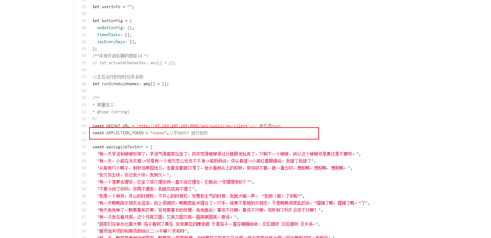

# wx-bot-server
微信机器人服务
微信机器人客户端，微信管理配置后台 
实现群管理、头像处理、智能机器人对话、好友互动、定时任务，情侣每日说等功能的配置

wx-server-back是参数配置的后台服务接口
wx-server-front是参数配置前端代码
后端使用 https://gitee.com/hzy6/HzyAdmin 使用.NET6+vue 快速开发

wx-bot-client是机器人客户端
使用wechaty的xp协议实现，项目地址：https://github.com/wechaty/puppet-xp

我已经搭建好后台配置的服务,也可以自行部署后台服务
后台配置地址:http://47.102.105.169:9901/client/index.html
需要可以联系作者(qq:1021907330)开通账号

## 使用方法:
1. 登录管理平台 申请天行数据秘钥，填入基础配置中进行保存。
2. 安装node16+ 环境，配置好环境变量
3. 修改客户端的应用token，文件地址wx-bot-client/examples/lizhou-bot.ts

登录指定版本微信登录后，启动机器人客户端即可
客户端下载地址:https://share.weiyun.com/2ZRdnk7r

 **后台修改配置后，可以给自己的机器人微信发送“更新配置”关键字，机器人会自动重新拉取最新配置** 

## 后台配置页面展示：

## 机器人客户端

